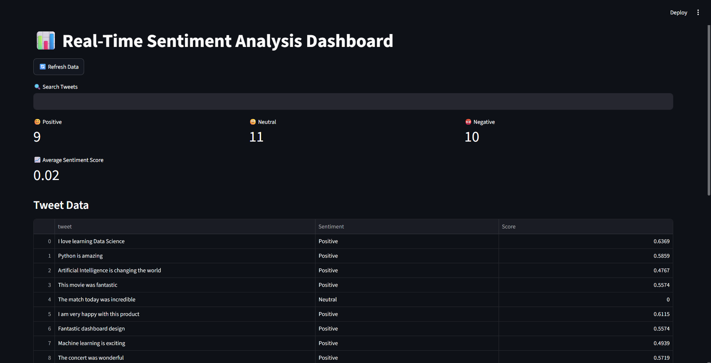
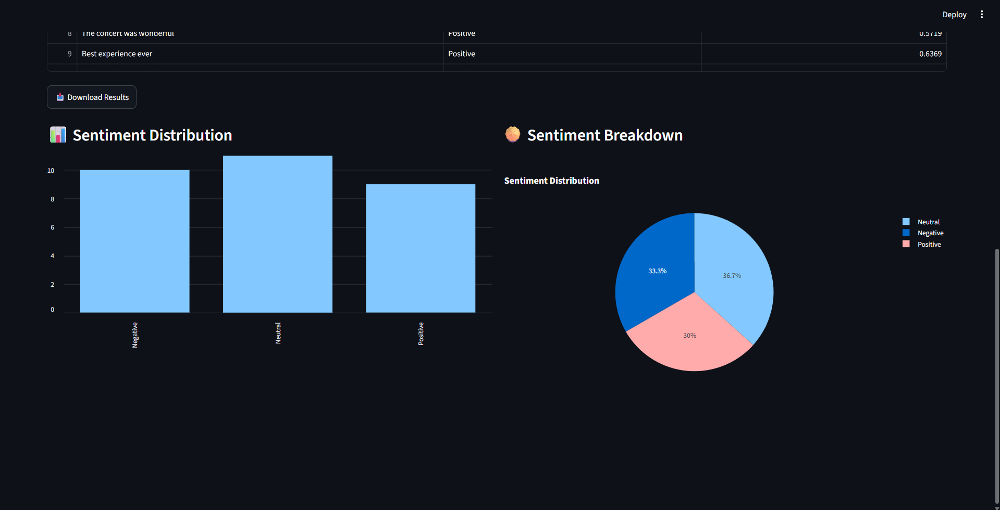

# 📊 Real-Time Sentiment Analysis Dashboard

## Overview

This project is a real-time sentiment analysis dashboard built using Streamlit and VADER Sentiment Analysis. The dashboard analyzes social media-style text data, classifies sentiments as Positive, Negative, or Neutral, and visualizes the results through interactive charts.

The project demonstrates Natural Language Processing (NLP), sentiment classification, data visualization, and dashboard development skills commonly used in Data Science and Analytics roles.

---

## Problem Statement

Organizations and businesses often need to understand public opinion regarding products, services, events, or brands from social media platforms.

The objective of this project is to:

* Analyze social media sentiment in real time.
* Classify text into Positive, Negative, and Neutral categories.
* Visualize sentiment distribution through interactive dashboards.
* Provide downloadable sentiment analysis results.

---

## Features

### Sentiment Analysis

* VADER Sentiment Analyzer
* Positive, Negative, and Neutral classification
* Compound sentiment score calculation

### Dashboard Features

* Real-time sentiment analysis
* Search tweets functionality
* Refresh dashboard data
* KPI metric cards
* Interactive sentiment visualizations
* CSV export functionality

### Visualizations

* Sentiment Distribution Bar Chart
* Sentiment Breakdown Pie Chart
* KPI Metrics Dashboard

---

## Technologies Used

* Python
* Streamlit
* Pandas
* Plotly
* VADER Sentiment Analyzer
* Tweepy (Twitter API Integration Ready)

---

## Project Workflow

### 1. Data Collection

Social media-style text data is collected through the tweet stream module.

### 2. Data Processing

The text data is cleaned and prepared for sentiment analysis.

### 3. Sentiment Classification

VADER analyzes each tweet and generates:

* Sentiment Label
* Compound Sentiment Score

### 4. Dashboard Visualization

The results are displayed through:

* KPI Cards
* Data Tables
* Bar Charts
* Pie Charts

### 5. Export Results

Users can download analyzed sentiment data as a CSV file.

---

## Dashboard Screenshots

### Dashboard Overview



### Sentiment Visualizations



---

## Project Structure

```text
Real-Time-Sentiment-Analysis-Dashboard/
│
├── screenshots/
│   ├── dashboard_overview.png
│   └── sentiment_charts.png
│
├── data/
│
├── app.py
├── sentiment_analyzer.py
├── twitter_stream.py
├── requirements.txt
├── README.md
└── .gitignore
```

---

## Installation

### Clone Repository

```bash
git clone <repository-url>
cd Real-Time-Sentiment-Analysis-Dashboard
```

### Create Virtual Environment

```bash
python -m venv venv
```

### Activate Environment

```bash
venv\Scripts\activate
```

### Install Dependencies

```bash
pip install -r requirements.txt
```

---

## Run Application

```bash
streamlit run app.py
```

The dashboard will open in your browser at:

```text
http://localhost:8501
```

---

## Future Improvements

* Live Twitter/X API integration using Tweepy
* Reddit sentiment analysis support
* BERT-based sentiment classification
* Real-time streaming of social media posts
* Cloud deployment using Streamlit Community Cloud
* Historical sentiment trend analysis

---

## Conclusion

This project demonstrates the practical application of Natural Language Processing and sentiment analysis techniques through an interactive dashboard.

The system successfully classifies social media text into sentiment categories and provides meaningful visual insights using modern data visualization tools.

The project showcases skills in:

* Natural Language Processing (NLP)
* Sentiment Analysis
* Data Visualization
* Dashboard Development
* Python Programming

making it a strong portfolio project for Data Science and Analytics roles.

---

## Author

**Ajinkya Mariche**

Data Science Intern Project
